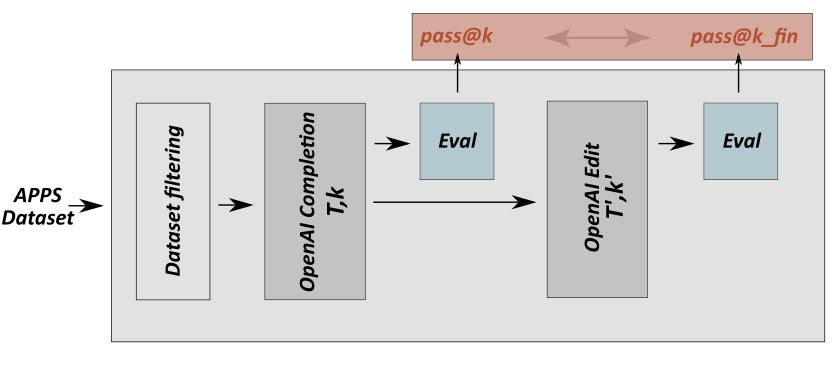

#  Using Codex's Edit API to Improve Codex's Python Code Generation from Natural Language

In the following we illustrate the evaluation pipeline used for the experiments of this project, and the corresponding folders in this repo:  

 

- OpenAI Completion: `./Completions`.  
- OpenAI Edit: `./Edit_Insert`.  
- Eval: `./Evaluation`.  
