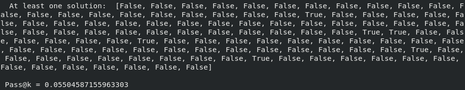
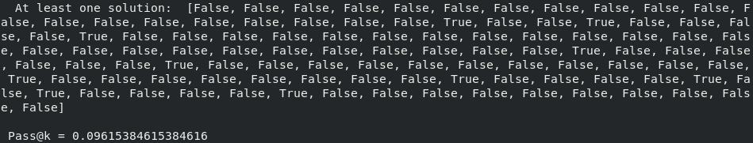

This folder contains all the necessary scripts to perform evaluations and compute pass rates on a given set of input code implemenatiions, each on coming with the corresponding set of unit tests to execute.
In the context of our work, this evaluation is first perfomed on the Completion results, and then again on the Edited results, as illustrated in the evaluation pipeline below: 

 

 Before launching the script [test_solutions.py](./test_solutions.py), the set of target prompts, and corresponding solutions that we want to test, has to be stored into a .json file. In order to automate this process for large experiments, select the target folder containing the prompts and the solutions in [apps_create_spilt.py](./apps_create_split.py) (ex:experiment_1,experiment_2, ecc..), and run the script to generate `train.json` and `test.json` that contains all the paths to the target prompt-solutions folders. Then, in order to run evaluation, launch the following command:

`python test_solutions.py -t <target_json>`

This automatically prints the pass@k metric for the target batch of prompts evaluated, and saves the results to `./results`.

While the `apps_create_spilt.py` and `testing_util.py` scripts have been borrowed integrally from https://github.com/hendrycks/apps , the "test_solutions.py" script, which drive the evaluations, has been built starting from some scripts provided by APPS and significantly restructured to address our own needs for calculating the correct evaluation metrics, which are different from those used by the APPS authors.

### Experiment 1 results:

The first experiment (experiment 1), conducted on ~100 samples from the introductory problems of APPS dataset, shows the following results:  
- Pass@2 metric after Completion(T=0.5, k=2)=5.5% 

  
- Pass@2 metric after Completion(T=0.5, k=2) + Edit(T'=0.5,k'=2)=9.61%

  

