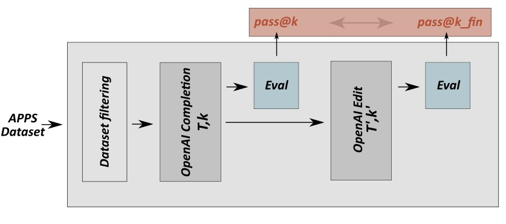

This folder contains all the necessary scripts to perform evaluations and compute pass rates on a given set of input code implemenatiions, each on coming with the corresponding set of unit tests to execute.
In the context of our work, this evaluation is first perfomed on the Completion results, and then again on the Edited results, as illustrated in the evaluation pipeline below: 

 

 Before launching the script [test_solutions.py](./test_solutions.py), the set of target prompts, and corresponding solutions that we want to test, has to be stored into a .json file. In order to do that automaticallt for large experiments, hardcode the target folder containing the prompts and the solutions in [apps_create_spilt.py](./apps_create_split.py), and run the script that generates `train.json` and `test.json` that contains all the paths to the target prompt-solutions folders. Then, in order to run evaluation, launch the following command:

`python test_solutions.py -t <target_json>`

This automatically prints the pass@k metric for the target batch of prompts evaluated, and saves the results to `./results`.

Note that even though the results of Codex completions for the target prompts are still not ready in the correpsonding folders, the evaluation framework described above can be tested by setting `target_json=test1.json`, which points to 2 problems where the `./codex_solutions` folder, which should in theory contain the codex generated code for those prompts, has been copied by the corresponding `solutions.json` files provided by APPS, just for the purpose of testing. By introducing bugs into such correct solutions, it can be seen how the caluclated pass@k metric varies accordingly.

While the `apps_create_spilt.py` and `testing_util.py` scripts have been borrowed integrally from https://github.com/hendrycks/apps , the "test_solutions.py" script, which drive the evaluations, has been built starting from some scripts provided by APPS and significantly restructured to address our own needs for calculating the correct evaluation metrics, which are different from those used by the APPS authors.
